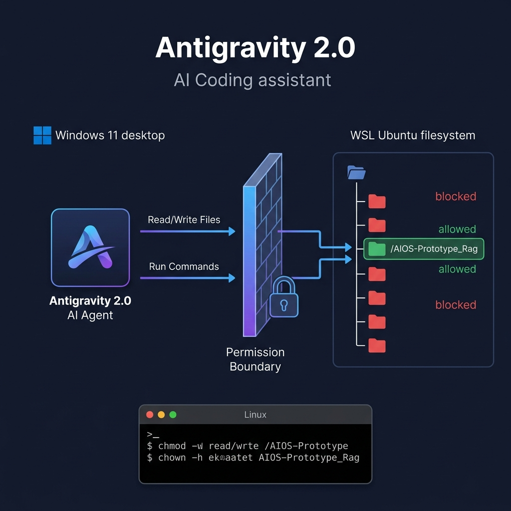

# LinkedIn Post — Antigravity 2.0 × WSL: Secure AI Vibe Coding

> **Copy the section below (between the horizontal rules) for your LinkedIn post.**
> The diagram image is saved at: `docs/screenshots/05_antigravity_wsl_security_architecture.png`

---

## 🔐 I Let an AI Agent Code Inside My Linux Environment — Here's How I Made It Safe

I just shipped a production-grade AI-Native Operating System prototype — an entire full-stack project with a Python daemon, Express API, React dashboard, FAISS vector database, MongoDB Atlas cloud memory, and a Kaggle GPU inference pipeline.

The twist? I didn't write most of it alone.

I used **Antigravity 2.0** — Google DeepMind's agentic AI coding assistant — and let it operate directly inside my **WSL (Windows Subsystem for Linux)** Ubuntu environment from my Windows machine.

But here's the thing nobody tells you about AI-assisted coding:

**If you give an AI agent unrestricted access to your Linux filesystem, you're one hallucination away from a disaster.**

So I built a security boundary. Here's the exact architecture and every command I used. 👇

---

### 🏗️ THE ARCHITECTURE: How Antigravity 2.0 Operates Your WSL From Windows

```
┌────────────────────────────────────────────────────────────┐
│                    WINDOWS 11 HOST                         │
│                                                            │
│   ┌──────────────────────────────────────────────────┐    │
│   │          Antigravity 2.0 (AI Agent)              │    │
│   │   • Reads/writes files via \\wsl.localhost\...   │    │
│   │   • Runs commands via `wsl -d Ubuntu -- ...`     │    │
│   │   • CANNOT access anything outside workspace     │    │
│   └──────────────────┬───────────────────────────────┘    │
│                      │                                     │
│         ┌────────────▼──────────────┐                     │
│         │  PERMISSION BOUNDARY      │                     │
│         │  \\wsl.localhost\Ubuntu\   │                     │
│         │  Only mapped workspace    │                     │
│         └────────────┬──────────────┘                     │
│                      │                                     │
├──────────────────────┼─────────────────────────────────────┤
│                      │     WSL 2 (Ubuntu 22.04)            │
│                      ▼                                     │
│   /home/anand_raj/                                         │
│   ├── .bash_history      ← 🔴 BLOCKED (750 on home dir)  │
│   ├── .ssh/              ← 🔴 BLOCKED (700 permissions)   │
│   ├── .env               ← 🔴 BLOCKED (read requires ask) │
│   ├── .kaggle/           ← 🔴 BLOCKED (API credentials)   │
│   ├── .config/           ← 🔴 BLOCKED (750 permissions)   │
│   │                                                        │
│   └── AIOS-Prototype_Rag/ ← ✅ ALLOWED (777 workspace)    │
│       ├── daemon/         ✅ Read + Write + Execute        │
│       ├── api/            ✅ Read + Write + Execute        │
│       ├── frontend/       ✅ Read + Write + Execute        │
│       ├── tests/          ✅ Read + Write + Execute        │
│       ├── docs/           ✅ Read + Write + Execute        │
│       ├── scripts/        ✅ Read + Write + Execute        │
│       └── .env            🟡 Requires explicit user ask    │
│                                                            │
└────────────────────────────────────────────────────────────┘
```



---

### 🔧 STEP-BY-STEP: How I Set This Up

#### Step 1: Lock Down Your Home Directory

By default, your WSL home directory might be open. Lock it down first:

```bash
# Set home directory to 750 — only YOU can access it
chmod 750 /home/anand_raj

# Verify: drwxr-x--- (owner: rwx, group: r-x, others: ---)
ls -la /home/
```

**What this does:** Even if the AI agent somehow escapes the workspace boundary, it physically cannot read `.ssh/`, `.bash_history`, `.kaggle/`, or any other sensitive dotfile in your home directory. Linux kernel-level enforcement.

#### Step 2: Create Your Workspace with Open Permissions

```bash
# Make the project folder fully accessible to the AI agent
chmod 777 /home/anand_raj/AIOS-Prototype_Rag

# Ensure all files inside are owned by you
chown -R anand_raj:anand_raj /home/anand_raj/AIOS-Prototype_Rag
```

**What this does:** The `777` permission on the project folder means the AI agent (operating as your user through WSL) can read, write, and execute anything inside. But ONLY inside this folder.

#### Step 3: Protect Secrets Even Inside the Workspace

```bash
# Lock .env files — agent must explicitly ask before reading
chmod 600 /home/anand_raj/AIOS-Prototype_Rag/.env
```

**What this does:** The `.env` file contains API keys, database URIs, and JWT secrets. Even though it's inside the workspace, the AI agent's permission system requires it to ask you before reading any `.env` file. Double protection: Linux permissions + Antigravity's built-in safeguard.

#### Step 4: Configure WSL for Your Default User

Edit `/etc/wsl.conf` inside your WSL:

```ini
[boot]
systemd=true

[user]
default=anand_raj
```

**What this does:** Ensures every WSL session runs as YOUR user — not root. The AI agent inherits your user's permissions, so all the `chmod` rules we set actually apply.

#### Step 5: Point Antigravity to Your WSL Workspace

When you open Antigravity 2.0 on Windows, set your workspace to the WSL path:

```
\\wsl.localhost\Ubuntu\home\anand_raj\AIOS-Prototype_Rag
```

This is the magic bridge. From the AI's perspective, it's reading and writing to a Windows network path. But behind the scenes, every file operation goes through the WSL 2 Linux kernel, enforcing all your chmod/chown rules.

---

### 🛡️ THE THREE-LAYER SECURITY MODEL

Here's the full defence-in-depth stack that protects my environment:

```
┌─────────────────────────────────────────────────┐
│  LAYER 1: Antigravity Permission System         │
│  • Workspace scoped to ONE folder only          │
│  • .env, .ssh, credentials → requires user ask  │
│  • Commands → requires user approval             │
│  • No wildcard (*) permissions allowed           │
├─────────────────────────────────────────────────┤
│  LAYER 2: Linux Filesystem Permissions          │
│  • Home dir: chmod 750 (blocks outsiders)       │
│  • Workspace: chmod 777 (AI can operate)        │
│  • .env: chmod 600 (owner-only read)            │
│  • chown: all files owned by anand_raj          │
├─────────────────────────────────────────────────┤
│  LAYER 3: WSL 2 Kernel Isolation                │
│  • Runs in a lightweight Hyper-V VM             │
│  • Separate Linux kernel from Windows           │
│  • Network namespace isolation                  │
│  • wsl.conf enforces non-root default user      │
└─────────────────────────────────────────────────┘
```

---

### 🎯 THE RESULT: What This Workflow Produced

Using this setup, Antigravity 2.0 and I built in 3 days:

✅ A Python asyncio daemon that monitors Linux system telemetry in real-time
✅ A hybrid FAISS + MongoDB Atlas RAG retrieval system (601 vectors)
✅ An Express 5 REST + WebSocket API with JWT auth & RBAC
✅ A React 18 + TypeScript transparency dashboard with live streaming
✅ A Deterministic Control Plane with SHA-256 tamper-evident audit logging
✅ Cloud GPU inference via Kaggle + Ngrok encrypted tunnel
✅ A complete test suite with 56 passing tests
✅ An industry-grade README with architecture diagrams
✅ A published blog post with proof-of-concept screenshots

All while the AI **never once accessed** my SSH keys, Kaggle credentials, bash history, or any file outside the project folder.

---

### 🧠 KEY TAKEAWAYS FOR AI-ASSISTED DEVELOPMENT

1. **Don't give AI agents root access.** Ever. Use `chmod 750` on your home directory and scope the workspace to a single project folder.

2. **Secrets need double protection.** Even inside the workspace, `.env` files should be `chmod 600` AND flagged in the AI agent's permission system.

3. **WSL 2 is your best friend.** It gives you a real Linux kernel inside Windows with proper file permission enforcement — something Docker on Windows can't always guarantee.

4. **The `\\wsl.localhost\` path is the bridge.** It lets Windows-based AI tools operate natively on Linux files without SSH, without Docker, without complexity.

5. **Verify permissions before starting.** Run `ls -la` and `stat` on your directories before every coding session. One wrong `chmod` can expose everything.

---

### 💬 MY SECURITY CHECKLIST (Copy This)

```bash
# ── Before every AI coding session ──────────────────

# 1. Verify home directory is locked
ls -la /home/ | grep your_username
# Expected: drwxr-x--- (750)

# 2. Verify workspace is accessible
stat -c '%a %U:%G' /path/to/project
# Expected: 777 your_username:your_username

# 3. Verify .env is owner-only
stat -c '%a' /path/to/project/.env
# Expected: 600

# 4. Verify you're not root
whoami
# Expected: your_username (NOT root)

# 5. Check wsl.conf default user
cat /etc/wsl.conf
# Expected: default=your_username
```

---

This is the future of software development. AI agents that write production-grade code inside your real development environment — not in a sandbox, not in a playground, but in the same Linux filesystem where your services run.

The key is **not** avoiding AI coding tools. The key is building a security boundary tight enough that you can trust them.

What's your approach to securing AI-assisted development environments? I'd love to hear in the comments. 👇

---

#AI #VibeCoding #WSL #Linux #Security #AICoding #Antigravity #GoogleDeepMind #DevOps #SoftwareEngineering #CyberSecurity #OpenSource #FullStack #DeveloperTools #ProductionGrade

---

**🔗 Links:**
- 🌐 GitHub: [github.com/anan5093](https://github.com/anan5093)
- 💼 LinkedIn: [linkedin.com/in/anand-raj-006a41217](https://www.linkedin.com/in/anand-raj-006a41217/)
- 📝 Medium: [medium.com/@anand.ar1806](https://medium.com/@anand.ar1806)
- 🔬 Zenodo: [Research Archive](https://zenodo.org/me/uploads?q=&f=shared_with_me%3Afalse&l=list&p=1&s=10&sort=newest)

---

> **📌 How to post on LinkedIn:**
> 1. Copy everything between the two horizontal rules above
> 2. Upload the diagram image: `docs/screenshots/05_antigravity_wsl_security_architecture.png`
> 3. Also attach 1-2 dashboard screenshots from `docs/screenshots/` as proof of the finished product
> 4. LinkedIn has a 3000-character limit for posts without "see more" — the first ~600 characters (everything before "So I built a security boundary") will appear above the fold. This hook is designed to maximize click-through.
